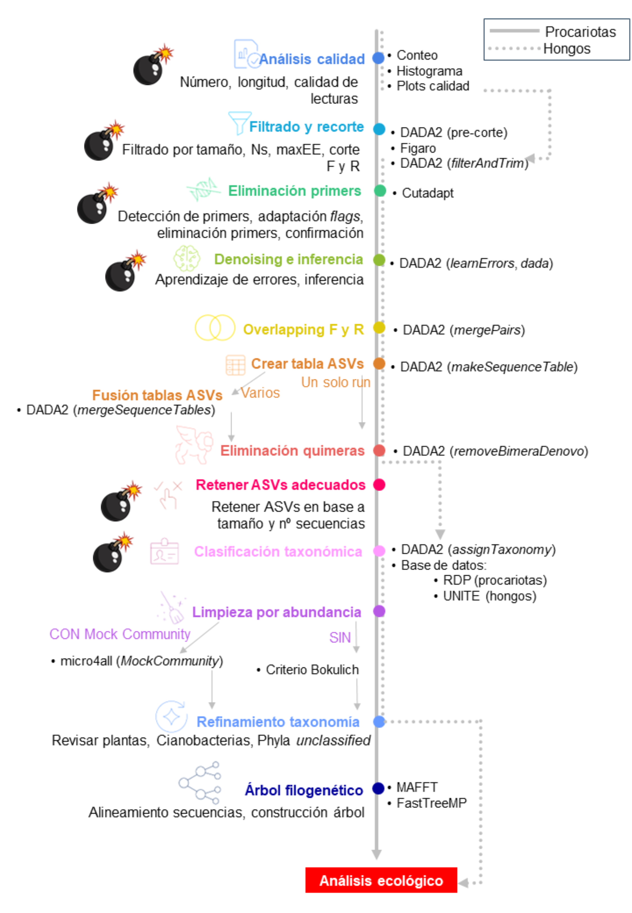

Al inicio del taller, se propone el flujo de trabajo detallado en la Figura F1, para el análisis de secuencias de amplicones del gen procariota *16S rRNA*, y de las regiones intergénicas fúngicas ITS1 e ITS2. Se espera poder ampliarlo y modificarlo acorde a las sugerencias y experiencia de los participantes del taller. 

