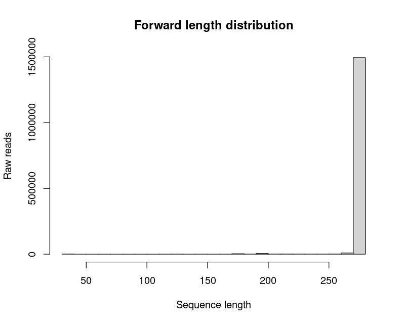
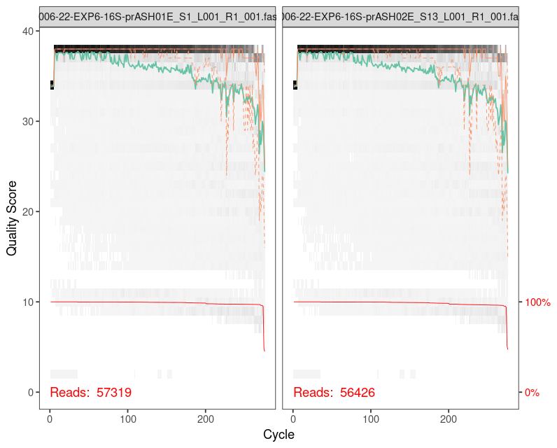
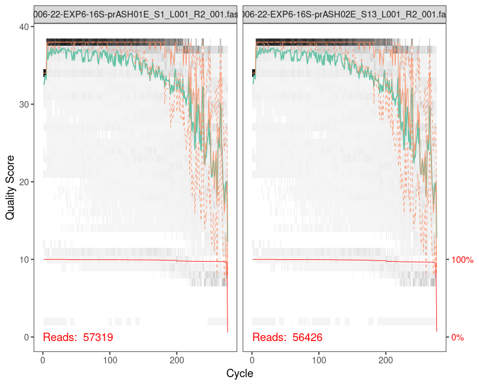
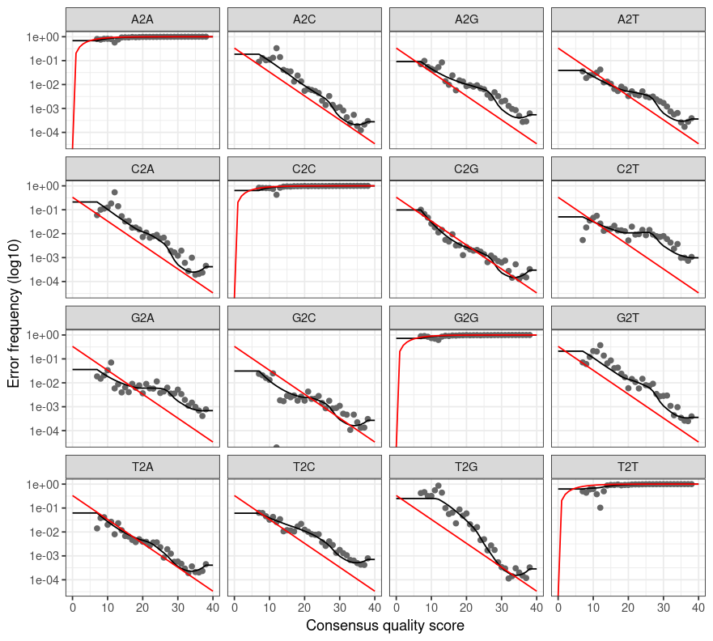
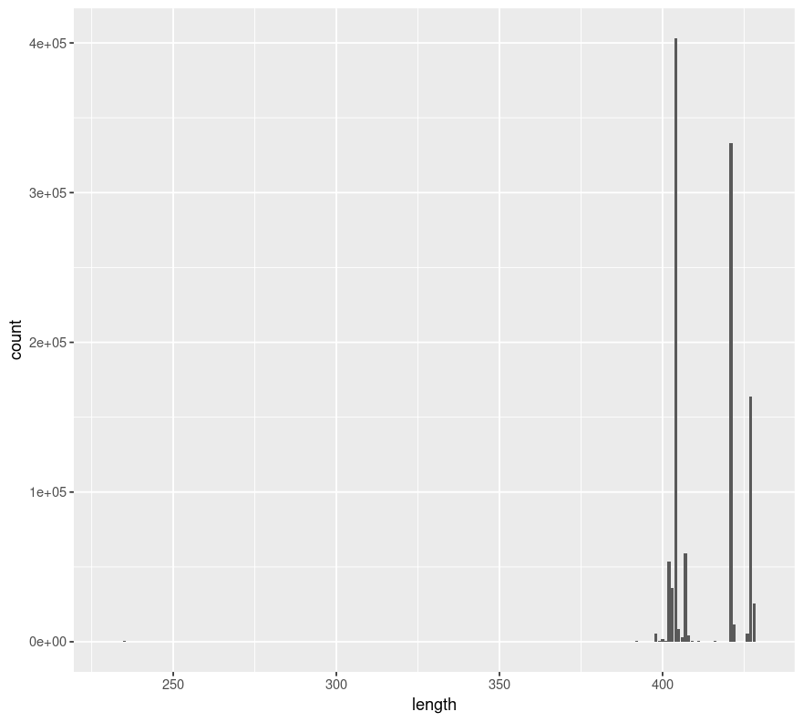

Hasta la fecha, el *gold standard* en los trabajos de metataxonomía o *metabarcoding* procariota es el gen  *16S rRNA*, siendo las regiones hipervaribales V4-V5 y V3-V4 unas de las más estudiadas. Es por ello que, las siguientes líneas de código están destinadas al procesamiento de lecturas obtenidas mediante tecnología de secuenciación masiva Illumina MiSeq.

En concreto, los *scripts* planteados han sido puestos a punto y verificados en una servidor Linux (distribución Ubuntu), con 96 cores y 500 MB de memoria RAM. Se ha empleado el lenguaje de programación R, con ciertas llamadas al lenguaje del sistema.

En este protocolo, se trabaja con muestras a las que ya se ha realizado el paso de *demultiplexing*, con archivos de tipo `fastq`, y con lecturas a las que se le han eliminado los adaptadores empleados durante la secuenciación. Se trata de una secuenciación de tipo *paired-end*, 2 X 275 pb (Illumina MiSeq), donde los archivos fastq contienen lecturas *Forward* y *Reverse* en el orden correspondiente. En el *run* de secuenciación se incluyen tres réplicas correspondientes a la Mock Community "ZymoBIOMICS Microbial Community Standard II (ZYMO Research)". Los primers empleados en este caso son Pro341F and Pro805R[^1] que amplifican las regiones hipervariables V3-V4 procariotas. Se han empleado como ejemplo muestras de endosfera radicular de 12 individuos de *Pinus sylvestris*.

[^1]: Takahashi, S., Tomita, J., Nishioka, K., Hisada, T., Nishijima, M. (2014) Development of a Prokaryotic Universal Primer for Simultaneous Analysis of Bacteria and Archaea Using Next-Generation Sequencing. PLoS ONE 9:e105592. https://doi.org/10.1371/journal.pone.0105592

Los datos de ejemplo han sido tomados de [este proyecto](https://anitalasa.github.io/Curso_Microbiota/), y han sido previamente publicados[^2].

[^2]: Lasa, A.V., Fernández-González, A.J., Villadas, P.J., Mercado-Blanco, J., Pérez-Luque, A.J., Fernández-López, M. (2024) Mediterranean pine forest decline: A matter of root-associated microbiota and climate change, Science of The Total Environment,926: 171858. https://doi.org/10.1016/j.scitotenv.2024.171858.

La mayoría de este protocolo emplea funciones del paquete **DADA2** desarrollado por Callahan y cols.[^3]

[^3]: Callahan, B.J., McMurdiem P.J., Rosen, M.J., Han A.W., Johnson, A.J.A., Holmes, S.P (2016). DADA2: High-resolution sample inference from Illumina amplicon data. Nature Methods, 13:581-583. https://doi.org/10.1038/nmeth.3869

# 0. Preparación del entorno de trabajo

``` r
#cargamos los paquetes necesarios
library(devtools) 
library(micro4all) 
library(dada2)
library(ShortRead) 
library(ggplot2) 
library(tidyverse) 
library(phyloseq)
library(seqinr) 
library(annotate) 
library(Biostrings) 
library(GUniFrac)
library(phangorn) 
library(vegan) 
library(pheatmap) 
library(colorspace)

# Establecemos el directorio de trabajo
setwd("~/Bacteria/") 

# Determinamos la ruta de los datos brutos
path = "~/Bacteria/raw_data/"
list.files(path)
```

Nos devuelve como resultado (por brevedad, mostramos solo las primeras líneas):

``` r
"NGS006-22-EXP6-16S-MOCK-1_S194_L001_R1_001.fastq.gz"
"NGS006-22-EXP6-16S-MOCK-1_S194_L001_R2_001.fastq.gz" 
"NGS006-22-EXP6-16S-MOCK-2_S195_L001_R1_001.fastq.gz" 
"NGS006-22-EXP6-16S-MOCK-2_S195_L001_R2_001.fastq.gz" 
"NGS006-22-EXP6-16S-MOCK-3_S196_L001_R1_001.fastq.gz" 
"NGS006-22-EXP6-16S-MOCK-3_S196_L001_R2_001.fastq.gz" 
"NGS006-22-EXP6-16S-prASH01E_S1_L001_R1_001.fastq.gz" 
"NGS006-22-EXP6-16S-prASH01E_S1_L001_R2_001.fastq.gz" 
"NGS006-22-EXP6-16S-prASH02E_S13_L001_R1_001.fastq.gz"
"NGS006-22-EXP6-16S-prASH02E_S13_L001_R2_001.fastq.gz"
"NGS006-22-EXP6-16S-prASH03E_S25_L001_R1_001.fastq.gz"
"NGS006-22-EXP6-16S-prASH03E_S25_L001_R2_001.fastq.gz"
"NGS006-22-EXP6-16S-prASH04E_S37_L001_R1_001.fastq.gz"
"NGS006-22-EXP6-16S-prASH04E_S37_L001_R2_001.fastq.gz"
"NGS006-22-EXP6-16S-prASH05E_S49_L001_R1_001.fastq.gz"
"NGS006-22-EXP6-16S-prASH05E_S49_L001_R2_001.fastq.gz"
"NGS006-22-EXP6-16S-prASH06E_S61_L001_R1_001.fastq.gz"
"NGS006-22-EXP6-16S-prASH06E_S61_L001_R2_001.fastq.gz"
"NGS006-22-EXP6-16S-prASH07E_S73_L001_R1_001.fastq.gz"
"NGS006-22-EXP6-16S-prASH07E_S73_L001_R2_001.fastq.gz"
"NGS006-22-EXP6-16S-prASH08E_S85_L001_R1_001.fastq.gz"
"NGS006-22-EXP6-16S-prASH08E_S85_L001_R2_001.fastq.gz"
"NGS006-22-EXP6-16S-prASH09E_S2_L001_R1_001.fastq.gz" 
"NGS006-22-EXP6-16S-prASH09E_S2_L001_R2_001.fastq.gz" 
"NGS006-22-EXP6-16S-prASH10E_S14_L001_R1_001.fastq.gz"
"NGS006-22-EXP6-16S-prASH10E_S14_L001_R2_001.fastq.gz"
"NGS006-22-EXP6-16S-prASH11E_S26_L001_R1_001.fastq.gz"
"NGS006-22-EXP6-16S-prASH11E_S26_L001_R2_001.fastq.gz"
"NGS006-22-EXP6-16S-prASH12E_S38_L001_R1_001.fastq.gz"
"NGS006-22-EXP6-16S-prASH12E_S38_L001_R2_001.fastq.gz"
"NGS006-22-EXP6-16S-prNSD01E_S59_L001_R1_001.fastq.gz"
"NGS006-22-EXP6-16S-prNSD01E_S59_L001_R2_001.fastq.gz"
```

Asignamos las lecturas ***Forward*** (R1) y las ***Reverse*** (R2) a sus respectivas variables, considerando el patrón del nombre de nuestros archivos:

``` r
fnFs = sort(list.files(path, pattern="_R1_001.fastq.gz", full.names = TRUE))
fnRs = sort(list.files(path, pattern="_R2_001.fastq.gz", full.names = TRUE))
```

Adaptamos el nombre de las muestras correspondientes a la Mock Community:

``` r
sample.names=gsub(pattern = "MOCK-", replacement = "MOCK", x = fnFs)
```

Extraemos el nombre real de las muestras:

``` r
sample.names = sapply(strsplit(basename(forwards), "_"), `[`, 1)
sample.names = sapply(strsplit(sample.names, "-"), `[`, 5)
sample.names #comprobamos si el nombre de las muestras es correcto
```

# 1. Análisis de calidad

Antes de comenzar con el procesamiento de las lecturas, es esencial comprobar la calidad de las mismas, para verificar el éxito de la secuenciación. Existen varias maneras de evaluar la calidad de la secuenciación.

## 1.a) Conteo del número de secuencias

Si el esfuerzo de secuenciación no ha sido suficiente, es necesario repetir el *run*. Para ello, podemos evaluar el número de lecturas obtenidas para cada muestra:

``` r
raw_reads_count = NULL

for (i in 1:length(fnFs)){
  raw_reads_count  = rbind(raw_reads_count, length(ShortRead::readFastq(fnFs[i]))) }

rownames(raw_reads_count)= sample.names 
colnames(raw_reads_count)= "Number of reads"

raw_reads_count #tambien: View(raw_reads_count)
min(raw_reads_count)
max(raw_reads_count)
```

En este ejemplo, observamos que `min(raw_reads_count)` nos devuelve `[1] 41580` y `max(raw_reads_count)` nos dice `[1] 66885`.

Teóricamente, para cada muestra debemos obtener el mismo número de lecturas con el primer *Forward* y con el primer *Reverse*. Si deseamos comprobarlo, solo debemos reemplazar la variable `fnFs` por `fnRs` en el código anterior.

El número de secuencias admisibles dependerá del tipo de secuenciación realizada (MiSeq, NovaSeq, etc.). En este caso, es suficiente (>41580 reads en todas las muestras).

## 1.b) Evaluación de la longitud de las secuencias

La estrategia de secuenciación seguida fue de 2 x 275bp en este *run*, por lo que debemos verificar que la mayoría de las lecturas se encuentran próximas a esta longitud. Lo haremos mediante un recuento de cada longitud detectada, y mediante representación gráfica en un histograma:

``` r
# Extraemos las lecturas F

reads = ShortRead::readFastq(fnFs)
uniques = unique(reads@quality@quality@ranges@width)

# Contamos el número de secuencias de cada longitud
counts = NULL 
for (i in 1:length(uniques)) {
  counts= rbind(counts,length(which(reads@quality@quality@ranges@width==uniques[i])))
}


histogram =  cbind(uniques,counts)
colnames(histogram) = c("Seq.length", "counts")

head(histogram[order(histogram[,1],decreasing = TRUE),]) #verificamos que la mayoria de las lecturas son del tamaño deseado 
hist(reads@quality@quality@ranges@width, main = "Forward length distribution", xlab="Sequence length", ylab = "Raw reads")
```

En la Figura S1 podemos observar el histograma obtenido. En él apreciamos que la inmensa mayoría de las lecturas tienen un tamaño aproximado de 275 bp.



De hecho, si apreciamos la salida del comando `head`, vemos que, efectivamente, la mayoría de las lecturas tienen 274-276bp:

``` r
  Seq.length  counts
[1,]        276 1075934
[2,]        275   67989
[3,]        274  342449
[4,]        273    6545
[5,]        272     724
[6,]        271     338
```

### 1.c) *Plots* de calidad

La mejor manera para conocer la calidad de las lecturas es representar los gráficos de calidad *Q-score* frente a la longitud de las secuencias, gracias a una función específica del paquete *dada2*:

``` r
plotQualityProfile(fnFs[4:5]) #seleccionamos las muestras que deseemos ver
plotQualityProfile(fnRs[4:5])
```

Las Figuras S2 y S3 nos muestras la "evolución" de la calidad en las lecturas F y R, respectivamente.





::: callout-note
INTERPRETACIÓN DEL GRÁFICO:

\-*heatmap* **gris**: frecuencia de los valores Q en cada posición. Se recomienda que se encuentren próximos a Q30, y que no bajen de Q20 (excepto al final de las lecturas R).

-línea **verde**: valor medio de calidad Q en cada posición de las lecturas.

-línea **naranja**: cuartiles de calidad en cada posición.

-línea **roja**: proporción normalizada de lecturas de cada longitud. Debe referenciarse respecto al eje Y derecho.
:::

Tal y como apreciamos, las lecturas F tienen mayor calidad que las R, y en estas últimas, la calidad decae especialmente al final (aunque casi no baja de Q20). También podemos comprobar que tanto en las lecturas F como en las R, la mayoría de las lecturas son del tamaño esperado.

::: callout-important
Es **importante** evaluar la longitud de las lecturas F y R para estimar si van a poder solapar o no.

¡Cuidado! Si vemos que no demasiadas lecturas alcanzan la longitud deseada, es posible que tengamos problemas para solaparlas. Es por ello que es necesario un buen número de lecturas, de tamaño suficiente y de calidad elevada.
:::

# 2. Filtrado y *recorte* de lecturas

## 2.1 Figaro

Para poder realizar el filtrado y truncar las lecturas en los puntos en los que comienza a bajar la calidad Q de las mismas, es recomendable utilizar la [herramienta **Figaro**](https://github.com/Zymo-Research/figaro#figaro "Click para ver el tutorial"). Esta herramientas nos ayudará a seleccionar de forma más precisa los mejores parámetros para truncar las lecturas y entrenar el modelo de *machine learning* que emplea DADA2.

### 2.1.1 Pre-corte

Figaro trabaja solamente si todas las secuencias tienen la **misma longitud**, por lo que, considerando las longitudes de nuestras lecturas, procederemos a realizar un corte inicial. En este ejemplo, truncaremos las lecturas a 274 pb, ya que la mayoría se encontraban en el rango 274-276 pb.

::: callout-important
El corte realizado es solamente para que Figaro funcione adecuadamente; es orientativo y para ayudarnos a la toma de decisiones. Sin embargo, posteriormente no trabajaremos sobre estas lecturas truncadas. En síntesis, Figaro es un programa aplicado exclusivamente para la toma de decisiones, exploratorio.
:::

``` r
figFs = file.path(path, "figaro", basename(fnFs))
figRs = file.path(path, "figaro", basename(fnRs))

# Trimming a 274 pb
out.figaro = filterAndTrim(fnFs, figFs, fnRs, figRs, compress=TRUE, 
                            multithread=6, truncLen=c(274,274)) #adaptar el numero de hilos conforme la potencia de nuestra maquina
```

### 2.1.2 Ejecución de Figaro en el sistema

Llamamos a Figaro en el sistema. Procedemos a truncar las lecturas, teniendo en cuenta el tamaño de los primers empleados (17 y 21 pb), y el tamaño del amplicón (426 bp) estimado:

``` r
figaro = system(("figaro -i ~/Bacteria/raw_data/figaro -o ~/Bacteria/raw_data/figaro -a 426 -f 17 -r 21"), intern=TRUE)
head(figaro)
```

Observemos las primeras líneas de la salida:

``` r
[1] "Forward read length: 274"                                                                                                   
[2] "Reverse read length: 274"                                                                                                   
[3] "{\"trimPosition\": [268, 216], \"maxExpectedError\": [2, 2], \"readRetentionPercent\": 81.77, \"score\": 79.76848379807731}"
[4] "{\"trimPosition\": [269, 215], \"maxExpectedError\": [2, 2], \"readRetentionPercent\": 81.75, \"score\": 79.75228592485807}"
[5] "{\"trimPosition\": [270, 214], \"maxExpectedError\": [2, 2], \"readRetentionPercent\": 81.74, \"score\": 79.73770783896074}"
[6] "{\"trimPosition\": [266, 218], \"maxExpectedError\": [2, 2], \"readRetentionPercent\": 81.74, \"score\": 79.73527815797786}"
```

Figaro ordena de manera descendente las opciones de truncado de lecturas conforme a la puntuación obtenida. En este ejemplo vemos que no existen grandes diferencias en las puntuaciones con las diferentes posiciones de truncado, y que en estos casos, el porcentaje de secuencias retenidas es bastante elevado. Además, los valores de maxEE no son excesivamente grandes (procurar que sean <=6). Seleccionaremos pues la primera opción: `truncLen= 268 (F) 216 (R), maxEE= 2 (F), 2 (R)`.

## 2.2. Filtrado y *recorte* definitivo

Considerando las recomendaciones de Figaro, realizamos el filtrado de las lecturas con la función `filterAndTrim` del paquete *dada2*.

``` r
filtFs = file.path(path, "filtered", basename(fnFs)) 
filtRs = file.path(path, "filtered", basename(fnRs))

out = filterAndTrim(fnFs, filtFs, fnRs, filtRs, truncLen=c(268,216), 
                     maxN=0, maxEE=c(2,2), truncQ=2, rm.phix=TRUE, 
                     compress=TRUE, multithread=6, minLen=50) 
```

::: callout-tip
Es interesante revisar los argumentos de la función *filterAndTrim* para comprender mejor cómo ajustarlos:

\-**truncLen**: indicamos las posiciones en las que queremos truncar las lecturas F y R, respectivamente.

\-**maxN**: número máximo de ambigüedades posibles.

\-**maxEE**: máximo valor de error esperado (*expected error*). Se calcula así: EE = sum(10\^(-Q/10).

\-**truncQ**: trunca las lecturas en el primer nucleótido que aparece con una calidad Q inferior o igual a la indicada. Es decir, todas las lecturas que pasen el filtro tendrán nucleótidos con un valor superior a *truncQ*.

\-**rm.phix**: si descartar, o no, lecturas pertenecientes al fago phi X174 (empleado en Illumina como control en la secuenciación).

\-**minLen**: longitud mínima de las lecturas.
:::

Ahora que ya comprendemos los parámetros, analizaremos la salida de `head(out)`:

``` r
                                               reads.in reads.out
NGS006-22-EXP6-16S-MOCK-1_S194_L001_R1_001.fastq.gz     63548     50983
NGS006-22-EXP6-16S-MOCK-2_S195_L001_R1_001.fastq.gz     64538     51874
NGS006-22-EXP6-16S-MOCK-3_S196_L001_R1_001.fastq.gz     51490     40954
NGS006-22-EXP6-16S-prASH01E_S1_L001_R1_001.fastq.gz     57319     44824
NGS006-22-EXP6-16S-prASH02E_S13_L001_R1_001.fastq.gz    56426     43682
NGS006-22-EXP6-16S-prASH03E_S25_L001_R1_001.fastq.gz    58576     45580
```

Nos informa del número de lecturas iniciales (`reads.in`) y el número de lectuas que han pasado el filtro (`reads.out`). Vemos que en todos los casos, el porcentaje de lecturas retenidas se encuentra cerca del 80%, tal y como infirió, aproximadamente, Figaro.

# 3. Eliminación de primers

Para eliminar todo tipo de secuencias nucleotídicas de origen no biológico, debemos eliminar los cebadores. Para ello, emplearemos la herramienta **Cutadapt**[^3].

[^3]: Martin, M. (2011) Cutadapt removes adapter sequences from high-throughput sequencing reads. EMBnet journal, 17: 1. https://doi.org/10.14806/ej.17.1.200

## 3.1 Preparación de datos para Cutadapt

En primer lugar, introducimos la secuencia de los primers empleados y calculamos todas sus posibles orientaciones.

``` r
FWD = "CCTACGGGNBGCASCAG"
REV = "GACTACNVGGGTATCTAATCC"

# Creamos la funcion para calcular los primers en todas sus orientaciones
allOrients = function(primer) {
  require(Biostrings)
  dna = DNAString(primer)  
  orients = c(Forward = dna, Complement = Biostrings::complement(dna), 
               Reverse = reverse(dna),  RevComp = reverseComplement(dna))
  return(sapply(orients, toString))  
}

#Aplicamos la función a los dos primers
FWD.orients = allOrients(FWD); FWD.orients
REV.orients = allOrients(REV); REV.orients
```

Ahora, revisamos cuántas veces aparece cada primer en las lecturas F y R, en todas su posibles orientaciones:

``` r
#Creamos una función para calcular el número de lecturas en las que aparecen los primers

primerHits = function(primer, fn) {
  nhits = vcountPattern(primer, sread(readFastq(fn)), fixed = FALSE)
  return(sum(nhits > 0))
}

#Le pasamos la función a la muestra que nos interese, en este caso la primera
rbind(FWD.ForwardReads = sapply(FWD.orients, primerHits, fn = filtFs[[1]]),
      FWD.ReverseReads = sapply(FWD.orients, primerHits, fn = filtRs[[1]]),
      REV.ForwardReads = sapply(REV.orients, primerHits, fn = filtFs[[1]]),
      REV.ReverseReads = sapply(REV.orients, primerHits, fn = filtRs[[1]]))
```

En nuestro ejemplo, detectamos estos primers:

``` r
                 Forward Complement Reverse RevComp
FWD.ForwardReads   49775          0       0       0
FWD.ReverseReads       3          0       0       0
REV.ForwardReads       3          0       0       0
REV.ReverseReads   49637          0       0       0
```

``` r
# Llamada del programa en nuestro servidor

cutadapt = "/usr/bin/cutadapt"
path.cut = file.path(path, "cutadapt") 
if(!dir.exists(path.cut)) dir.create(path.cut)

fnFs.cut = file.path(path.cut, basename(filtFs)) 
fnRs.cut = file.path(path.cut, basename(filtRs))
```

Cutadapt necesita una serie de etiquetas o *flags* para funcionar adecuadamente; si quieres conocer más detalles al respecto para poder adaptarlo a tus datos, sigue el tutorial propuesto [aquí](https://cutadapt.readthedocs.io/en/stable/guide.html).

``` r
FWD.RC = dada2:::rc(FWD) 
REV.RC = dada2:::rc(REV)

# Parámetros de detección de los 2 primers
R1.flags = paste0("-a", " ", "^",FWD,"...", REV.RC) 
R2.flags = paste0("-A"," ","^", REV, "...", FWD.RC)
```

## 3.2 Ejecución de Cutadapt y verificación de resultados

Al fin, ejecutamos el programa sobre nuestras lecturas, con las *flags* creadas:

``` r
for(i in seq_along(fnFs)) {
  system2(cutadapt, args = c(R1.flags, R2.flags, 
                             "-n", 2,"-m", 1, "--discard-untrimmed", "-j",6, "-o", 
                             fnFs.cut[i], "-p", fnRs.cut[i], filtFs[i], filtRs[i], 
                             "--report=minimal")) }
```

Con la función `primerHits` creada anteriormente, **verificamos el número de veces que se identifican los primers** despúes de eliminarlos:

``` r
rbind(FWD.ForwardReads = sapply(FWD.orients, primerHits, fn = fnFs.cut[[1]]),
      FWD.ReverseReads = sapply(FWD.orients, primerHits, fn = fnRs.cut[[1]]),
      REV.ForwardReads = sapply(REV.orients, primerHits, fn = fnFs.cut[[1]]),
      REV.ReverseReads = sapply(REV.orients, primerHits, fn = fnRs.cut[[1]]))
```

En nuestro ejemplo:

``` r
                 Forward Complement Reverse RevComp
FWD.ForwardReads       0          0       0       0
FWD.ReverseReads       0          0       0       0
REV.ForwardReads       0          0       0       0
REV.ReverseReads       0          0       0       0
```

::: callout-note
En algunos casos, después de la eliminación de los primers mediante Cutadapt es posible que todavía detectemos alguno con la función *primerHits*. No debemos asustarnos (siempre y cuando este número no sea excesivamente elevado), pues dicha función y Cutadapt funcionan de forma diferente y pueden detectarse discrepancias.
:::

# 4. *Denoising*

Una vez eliminados los primers, debemos realizar el ***denoising*** de las muestras, es decir, identificar y corregir los errores introducidos por las plataformas de secuenciación. Se trata de aplicar modelos para diferenciar entre secuencias biológicas reales y aquellas que han acumulado errores.

## 4.1 Entrenamiento del modelo de errores

Para ello, emplearemos la función *learnErrors* del paquete *dada2*. Esta función aprende los errores a partir de tu propio conjunto de datos, alternando la estimación del error y la inferencia de la composición de la muestra, hasta que ambos convergen en una solución única consistente.

``` r
errF = learnErrors(fnFs.cut, multithread=6, verbose=1) 
errR = learnErrors(fnRs.cut, multithread=6, verbose=1)
```
:::callout-note
En *runs* de baja calidad o muestras problemáticas es posible que no se alcance la convergencia con las iteraciones por defecto. Generalmente esto sucede porque tenemos un exceso de errores o insuficientes bases de calidad para entrener el modelo. Para intenar lograr la convergencia, podemos aumentar el número de iteraciones, y si tampoco es suficiente, aumentar el número de bases a utilizar para entrenar el modelo (por defecto, 10^8). Si aún así tampoco se alcanza la convergencia, es necesario revisar el número de secuencias de que superan el paso de *trimming* y plantearse si se puede ser más laxo o no con la calidad mínima y el error máximo esperado (para recuperar más secuencias, y por ende, más nucleótidos para poder entrenar adecuadamente el modelo).
:::

En nuestro ejemplo, la convergencia se alcanza en la iteración 6 (F y R).

A continuación, calcularemos y visualizaremos los gráficos de la estimación de los errores (Figura S4).

``` r
plotErrors(errF, nominalQ=TRUE) 
plotErrors(errR, nominalQ=TRUE)
```



El tipo de figura obtenida nos indica el progreso de la tasa de error estimada conforme aumenta la calidad Q de las lecturas. La línea **roja** nos marca la tasa de error prevista según la definición nominal del valor Q, mientras que la línea **negra** indica la tasa de error estimada tras alcanzar la convergencia del modelo de *machine learning*. Los **círculos negros** representar los errores observados en nuestras muestras.

Como podemos apreciar en la Figura S4, conforme aumenta la calidad Q de las lecturas, la tasa de error estimada disminuye para todas las transiciones. Además, podemos apreciar que nuestros valores de error estimado (línea negra) se acercan, relativamente, a la tasa de error observado (puntos negros).

## 4.2. Inferencia de las muestras

A partir del error aprendido, aplicamos la función *dada*, que nos devolverá la composición inferida de las muestras considerando el error aprendido.

``` r
dadaFs = dada(fnFs.cut, err=errF, multithread=6) 
dadaRs = dada(fnRs.cut, err=errR, multithread=6) 

names(dadaFs) = sample.names #le damos el nombre de las muestras a las muestras inferidas
names(dadaRs) = sample.names
```

# 5. *Overlapping* de lecturas F y R

Ya tenemos lecturas de alta calidad y con errores corregidos, por lo que es el momento de ensamblar las lecturas F y R correspondientes a los mismos amplicones. Para realizar el *overlapping*, usaremos la función *mergePairs* de DADA2, la cual realiza el ensamblaje mediante alineamiento y solape de al menos 12 bp, sin cabida a ningún error o *missmatch*. Estos parámetros deben modificarse en caso de lecturas más cortas y/o de baja calidad:

``` r
mergers = mergePairs(dadaFs, fnFs.cut, dadaRs, fnRs.cut, verbose=TRUE) 
head(mergers[[4]])
```

# 6. Crear tabla de ASVs

Una vez "reconstruidos" los amplicones, es hora de detectar *Amplicon Sequence Variants* (ASVs), concepto similar a *Unidad Taxonómica Operacional*, pero al 99% de identidad de secuencia.

``` r
seqtab = makeSequenceTable(mergers)
dim(seqtab)
```

En este ejemplo, las dimensiones de la tabla de ASVs son `27 5954`, es decir, en 27 muestras se han detectado 5954 ASVs.

::: callout-note
En el caso de que un proyecto de secuenciación incluya muchas muestras y haya sido necesario correr varios *run* de secuenciación, este es el punto en el que deben fusionarse. ¿Por qué no los hemos fusionado antes? Es sencillo: como en cualquier experimento, cada *run* de secuenciación lleva consigo asociado un error, por lo que debe calcularse el modelo de *machine learning* (*learnErrors*) e inferir las muestras considerando el posible error de los *runs* correspondientes.

Para fusionar varias tablas de ASVs relativas a diferentes *runs*, el procedimiento a seguir es este:

``` r
#Cargamos las tablas de ASVs de cada run
seqtab_run1=readRDS("seqtab_run1.rds")
seqtab_run2=readRDS("seqtab_run2.rds")
seqtab_run3=readRDS("seqtab_run3.rds")

#Fusionamos
mergedSeqTab=mergeSequenceTables(seqtab_run1,seqtab_run2,seqtab_run3, repeats="sum")
```
:::

# 7. Detección y eliminación de quimeras

Aunque DADA2 elimina posibles errores de secuenciación, el modelo entrenado no es capaz de identificar posibles quimeras, por lo que lo haremos ahora:

``` r
# Eliminación de quimeras denovo
seqtab.nochim =removeBimeraDenovo(seqtab, method="consensus", multithread=6,verbose=TRUE) 
dim(seqtab.nochim)
sum(seqtab.nochim)/sum(seqtab)
```

En nuestro ejemplo, observamos que en nuestras 27 muestras tenemos ahora `5314` ASVs, y que el `99.11% del total de secuencias` no son quiméricas.

Si hubiéramos obtenido un valor bajo de secuencias no quiméricas, deberíamos revisar a conciencia todo el procesamiento anteriormente realizado y mejorar el ajuste de los parámetros. En la mayoría de los casos, el origen suele ser errores en la lectura de los primers (o la no eliminación de estos).

# 8. Retener ASVs del tamaño esperado/adecuado

Aunque hayamos eliminado las quimeras, es conveniente revisar la longitud de las secuencias de los ASVs de calidad obtenidos, y eliminar todos aquellos que no se ajustan bien al tamaño del amplicón esperado. Para ello, debemos conocer previamente el tamaño estimado del amplicón de la región hipervariable con la que estamos trabajando.

Lo calculamos:

``` r
table(nchar(getSequences(seqtab.nochim)))
```

Observemos el resultado:

``` r
230 231 232 234 235 236 237 238 240 242 243 244 246 248 250 251 252 253 254 255 257 258 259 260 263 264 265 266 267 269 270 271 272 273 275 276 279 281 
  3   1   2   1   5   1   3   1   1   1   2   3   1   1   2  27   4   1   6   6   1   5   2   4   2   1   4  15   2   1   2   1   9   2   5   3   1   1 
283 284 286 287 290 291 292 295 296 298 300 301 302 303 304 306 308 309 310 311 312 314 316 317 318 319 322 323 326 327 329 330 333 335 336 337 338 339 
  2   3   1   2   3   1   1   1   1   6   2   1   2   5   6   1   7  28   8   5   1   1   2   4   2   1   2   3   1   2   3   1   1   2   8   1  10  46 
340 341 342 343 344 346 347 348 349 350 351 353 356 359 360 362 363 366 367 368 370 372 373 374 375 376 377 378 382 387 388 391 392 394 395 396 398 399 
  7   3   1   4   1   1   2   1   1   1   8   2   2   1   1   2   3   9   2   5   1   2   5   2   1   1   2   5   1  16   1   1  15   3   1   4  16   7 
400 401 402 403 404 405 406 407 408 409 410 411 412 413 414 415 416 417 418 419 420 421 422 423 424 425 426 427 428 430 
  8  16 796 457 908 190  78 300  23  19  17  27   4  10  10   7  28   2   6  22  21  94 349  11  37  21 335 876 189   2
```

La primera línea representa la longitud de las secuencias, y la segunda, el número de ASVs para cada longitud.

Veamos el número de secuencias de cada longitud:

``` r
reads.per.seqlen = tapply(colSums(seqtab.nochim), factor(nchar(getSequences(seqtab.nochim))), sum) 
reads.per.seqlen
```

Obtenemos:

``` r
230    231    232    234    235    236    237    238    240    242    243    244    246    248    250    251    252    253    254    255    257    258 
    14      4      5      4    451      3    297     10      2      7     17     15      3      4      4    262     34      4     34     23     20     24 
   259    260    263    264    265    266    267    269    270    271    272    273    275    276    279    281    283    284    286    287    290    291 
     9     37      5      5     21     56      7      7      7      2    177      6     17      9      4      2     33     15      3     16     12      2 
   292    295    296    298    300    301    302    303    304    306    308    309    310    311    312    314    316    317    318    319    322    323 
     3      5      2     33     10      2      4     18     27      2     40    180     44     22      8      2      7     11      5      4     62      6 
   326    327    329    330    333    335    336    337    338    339    340    341    342    343    344    346    347    348    349    350    351    353 
     4     15     12      2      2     16     27     13     46    180     22     15      4     16     14      2      7      4      3      6     41     10 
   356    359    360    362    363    366    367    368    370    372    373    374    375    376    377    378    382    387    388    391    392    394 
    12      3      2      6      6    278      6     25      3      9     31     10      2      2      9     15      3     96     10      4    787     23 
   395    396    398    399    400    401    402    403    404    405    406    407    408    409    410    411    412    413    414    415    416    417 
     9     26   5340    847   1721    425  53720  36133 402951   8344   3326  59042   4096    330    160    385     71    147    137     66    814     22 
   418    419    420    421    422    423    424    425    426    427    428    430 
    44    129    179 333189  11566    181    213    199   5649 164022  25358     21
```

La primera línea nos indica el ASV, mientras que la segunda el número de secuencias detectadas para cada uno de ellos. Podemos obtener la misma información en un gráfico:

``` r
table_reads_seqlen = data.frame(length = as.numeric(names(reads.per.seqlen)), count=reads.per.seqlen) 
ggplot(data=table_reads_seqlen, aes(x=length, y=count)) + geom_col()
```



Aunque nuestro amplicón tiene un tamaño esperado de aproximadamente 426 bp, debemos tener en cuesta que esta estimación se realiza en base al genoma de *E. coli*, pero que puede existir variabilidad respecto a la longitud del amplicón en esta región hipervariable del gen procariota *16S rRNA*. Así pues, para intentar cubrir el rango más amplio posible de longitud de esta zona, y con ello, la mayor diversidad posible de organismos, seleccionaremos aquellos ASV con un tamaño de secuencia comprendido entre **378-430 bp**. De esta forma, garantizamos no perder **Archaea**, ya que el tamaño aproximado de las regiones hipervariables V3-V4 de estas se encuentra entre 400-460 bp.

``` r
seqtab.nochim = seqtab.nochim[,nchar(colnames(seqtab.nochim)) %in% seq(378,430)]
```

# 9. Clasificación taxonómica

Procedemos a clasificar taxonómicamente las secuencias representativas de cada ASV. Se pueden emplear diferentes bases de datos, aunque las más recomendadas para clasificar el gen *16S rRNA* son [Silva](https://www.arb-silva.de/), [GreenGenes](http://greengenes.microbio.me/greengenes_release/), [RDP](https://bio.tools/rdp) y [GTDB](https://gtdb.ecogenomic.org/). En este caso usaremos RDP, si bien es cierto que se recomienda añadir algunas modificaciones a la base de datos que se elija:

-   Si trabajamos con DNA de endosfera/raíz: introducir secuencias de plastos del hospedador, e incluso el genoma del hospedador.
-   DNA del fago phiX174, por si no lo hemos eliminado anteriormente.
-   Refinamiento de taxonomía en taxones del tipo '*Candidatus*' o mal clasificados.
-   Recuperación de categorías taxonómicas perdidas (rangos intermedios vacíos o que figuran como *Incertae sedis*)
-   etc.

Clasificamos:

```{.r}
taxa_rdp = assignTaxonomy(seqtab.nochim, "/home/databases/rdp_train_set_19_H.fa", multithread=6)
#introducir ruta base de datos elegida
```

El clasificador genera datos **NA** cuando no puede clasificar, pero lo reemplazaremos por *unclassified* para no perder ASVs en trabajos futuros. Además, adaptaremos el nombre de los ASV para que puedan ordenarse en función de su abundancia (primeros ASV, los más abundantes). El código siguiente es un reformateo de tablas:

```{.r}
taxa_rdp_na = apply(taxa_rdp, 2, tidyr::replace_na, "unclassified")[,1:6]

ASVt = t(seqtab.nochim) 
number.digit = nchar(as.integer(nrow(ASVt)))
ASV_names = sprintf(paste0("ASV%0", number.digit, "d"), 1:nrow(ASVt))

ASV_seqs = rownames(ASVt) #almacenamos las secuencias

ASV_table_classified = cbind(ASV_seqs, as.data.frame(taxa_rdp_na), ASV_names, as.data.frame(ASVt)) 
rownames(ASV_table_classified) = NULL
```

# 10. Limpieza por abundancia

A pesar de que ya hemos hecho filtrados de calidad, es posible que haya ASV espúreos poco frecuentes que deben ser eliminados de nuestras muestras. Por ejemplo, si hemos introducido algún control negativo, en este punto es posible que aún detectemos algún ASV en esas secuencias. Existen diferentes maneras de eliminarlos: 

## 10.a) Si hemos introducido Mock Community en el run

Si algunas de las muestras introducidas en el *run* de secuenciación son Mock Communities de composición conocida, podemos correr el siguiente código:

```{.r}
ASV_filtered_MOCK = MockCommunity(ASV_table_classified, mock_composition, ASV_column = "ASV_names")
```

Se trata de una función interactiva que nos va a preguntar en la consola si un determinado ASV (cuya afiliación taxonómica y abundancia relativa serán imprimidas por pantalla) es o no miembro de la Mock Community. Para poder responder, debemos conocer la identidad de los microorganismos que componen la Mock Community. En caso de que un ASV aparezca en las muestras de la Mock Community pero sea exógeno (no incluído teóricamente en la composición de la misma), su abundancia será utilizada como *cut-off* o límite de detección. De esta forma, todos los ASVs cuya abundancia relativa se encuentre por debajo de ese umbral, será considerados como espúreos.

Debemos introducir por teclado si el ASV que nos muestra será o no considerado para establecer el umbral de detección.

## 10.b) Si NO hemos introducido Mock Community en el run

En caso de no poseer muestras relativas a la Mock Community, se aplicarán las recomendaciones proporcionadas por Bokulich y cols. (2013)[^5]. Estos compañeros nos indican que los errores de secuenciación en Illumina inflan artificialmente la diversidad, y que es recomendable eliminar aquellos OTUs (~ASVs) que supongan **menos de un 0.005% del total de secuencias**.

```{.r}
ASV_sums = rowSums(ASV_table_classified[,9:ncol(ASV_table_classified)])

sum.total = sum(ASV_sums) #calculo numero total de secuencias

#Calcular cuantas secuencias son el 0.005% de nuestro dataset
nseq_cutoff = (0.005/100)*sum.total

#Filtrar segun el valor de Bokulich
ASV_filtered_bokulich = ASV_table_classified[which(ASV_sums>nseq_cutoff),]

ASV_table_bokulich = ASV_filtered_bokulich[order(ASV_filtered_bokulich[["ASV_names"]]),]
```

[^5]: Bokulich, N., Subramanian, S., Faith, J. et al., (2013) Quality-filtering vastly improves diversity estimates from Illumina amplicon sequencing. Nature Methods 10:57–59. https://doi.org/10.1038/nmeth.2276

# 11. Refinamiento de taxonomía 

Si bien hemos eliminado posibles ASVs espúreos, es interesante echar un vistazo a la clasificación taxonómica y depurarla, especialmente si trabajamos con muestras vegetales. Eliminaremos secuencias de calidad clasificadas como planta, plasto, eucariota, o no clasificadas a nivel de reino:

```{.r}
#este codigo esta adaptado como si tuvieramos Mock Community (OJO con el nombre de variables si aplicas el filtro de Bokulich)
ASV_final=ASV_filtered_MOCK[(which(ASV_filtered_MOCK$Genus!="Streptophyta"&
ASV_filtered_MOCK$Genus!="Mitochondria" &  ASV_filtered_MOCK$Genus!="Chlorophyta"  & ASV_filtered_MOCK$Genus!="Bacillariophyta" & ASV_filtered_MOCK$Family!="Streptophyta"  & ASV_filtered_MOCK$Family!="Chlorophyta" & ASV_filtered_MOCK$Family!="Bacillariophyta"  & ASV_filtered_MOCK$Family!="Mitochondria" & ASV_filtered_MOCK$Class!="Chloroplast"  & ASV_filtered_MOCK$Order!="Chloroplast" &ASV_filtered_MOCK$Family!="Chloroplast"  & ASV_filtered_MOCK$Kingdom!="Eukaryota" & ASV_filtered_MOCK$Kingdom!="unclassified")),]
```

Revisaremos también si las secuencias clasificadas como **Cyanobacteria** son procariotas o si son realmente cloroplastos (RDP clasifica los cloroplastos dentro del phylum Cyanobacteriota), y la taxonomía de las secuencias no clasificadas a nivel de Phylum. Guardaremos sus secuencias en formato Fasta, y realizaremos un BLASTn para ver a qué se parecen:

```{.r}
cianobacteria = ASV_final[which(ASV_final$Phylum=="Cyanobacteriota"),] 
seq_cianobacteria = as.list(cianobacteria$ASV_seqs)
write.fasta(seq_cianobacteria, names=cianobacteria$ASV_names, file.out="cianobacteria_phylum.fas", open = "w", nbchar =1000 , as.string = FALSE)

system(("/home/programas/ncbi-blast-2.13.0+/bin/blastn -query cianobacteria_phylum.fas -db /home/databases/nt -out cianobacteria_phylum_hits.txt -outfmt '6 std stitle' -show_gis -max_target_seqs 5 -parse_deflines -num_threads 10"),intern = TRUE)

unclass_phy = ASV_final[which(ASV_final$Phylum=="unclassified"),] 
seq_unclass = as.list(unclass_phy$ASV_seqs)
write.fasta(seq_unclass, names=unclass_phy$ASV_names, file.out="unclassified_phylum.fas", open = "w", nbchar =1000 , as.string = FALSE)

system(("/home/programas/ncbi-blast-2.13.0+/bin/blastn -query unclassified_phylum.fas -db /home/databases/nt -out unclassified_phylum_hits.txt -outfmt '6 std stitle' -show_gis -max_target_seqs 5 -parse_deflines -num_threads 10"),intern = TRUE)
```

Si definitivamente confirmamos que ciertos ASV no han sido bien clasificados con RDP y son, por ejemplo, secuencias del propio hospedador, o *Phyla* no clasificados, podríamos eliminarlos de la tabla de la siguiente manera:

```{.r}
ASV_final_all_filters=ASV_final[(which(ASV_final$ASV_names!="ASV01487")),] #eliminamos el ASV erroneo
```

# 12. Árbol filogenético

Es posible que nos interese generar un árbol filogenético de todos los ASVs detectados para facilitar análisis posteriores. Por ejemplo, para calcular distancias **Weighted UniFrac** entre comunidades microbianas, es necesario calcular previamente un árbol. La construcción del árbol se basa en los siguientes pasos:

## 12. 1 Alineamiento de secuencias

En este caso, usaremos el algoritmo [MAFFT](https://mafft.cbrc.jp/alignment/server/):

```{.r}
seq_fasta = as.list(ASV_final_all_filters$ASV_seqs) 
write.fasta(seq_fasta, names=ASV_final_all_filters$ASV_names, file.out="fasta_16S.fas", open = "w", nbchar =1000 , as.string = FALSE)
mafft = "/usr/bin/mafft" #set MAFFT's path

system2(mafft, args=c("--auto", "fasta_16S.fas>", "alignment"))
```


## 12. 2 Construcción del árbol filogenético

A partir del alineamiento de MAFFT, calcularemos un árbol filogenético mediante la [herramienta FastTreeMP](http://www.microbesonline.org/fasttree/):

```{.r}
FastTreeMP= "/home/programas/FastTreeMP/FastTreeMP"

system2(FastTreeMP, args="--version" )
system2(FastTreeMP, args = c("-gamma", "-nt", "-gtr", "-spr",4 ,"-mlacc", 2, "-slownni", "<alignment>", "tree"))

```